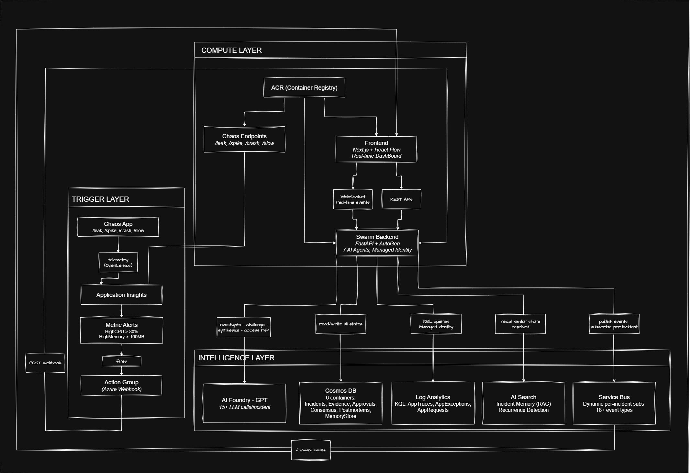

<p align="center">
  <h1 align="center">🐝 Auto-SRE Swarm</h1>
  <p align="center">
    <strong>Autonomous Multi-Agent Incident Investigation Through Collective Intelligence</strong>
  </p>
  <p align="center">
    <em>One agent investigates. A swarm of agents converges on truth.</em>
  </p>
  <p align="center">
    <a href="#architecture">Architecture</a> •
    <a href="#ai-integration">AI Integration</a> •
    <a href="#getting-started">Setup</a> •
    <a href="#demo">Demo</a> •
    <a href="#live-testing">Live Testing</a> •
    <a href="#tech-stack">Tech Stack</a>
  </p>
</p>

---

## 🎯 Problem Statement

Site Reliability Engineering teams face a critical bottleneck during cloud incidents: **Mean Time to Investigate (MTTI)**. When a P1 outage strikes at 3 AM, on-call engineers must manually correlate data across logs, metrics, deployments, and historical patterns — a cognitive load that no single human can handle efficiently under pressure.

**Auto-SRE Swarm** solves this by deploying a **swarm of 7 specialized AI agents** that self-organize to investigate incidents collaboratively — challenging each other's findings, building probabilistic consensus, and converging on root cause in minutes instead of hours.

This is not a pipeline of sequential LLM calls. It is a **distributed AI architecture** with emergent consensus, adaptive reinvestigation, and human-in-the-loop safety gates.

---

## 🏗️ Architecture

<a id="architecture"></a>

### System Overview

<p align="center">
  
</p>

### The Agent Swarm (7 Agents)

| Agent | Role | Responsibility |
|-------|------|----------------|
| 🎯 **Incident Commander** | Planner | Enriches context from Memory Store, handles P1 overrides, orchestrates rounds |
| 🔍 **Log Forensics** | Retriever | Queries Azure Monitor logs via KQL (`AppTraces`, `AppExceptions`), identifies error patterns |
| 📊 **Telemetry Intelligence** | Retriever | Analyzes metrics — RPS, latency percentiles, error rates, memory/CPU saturation |
| 🚀 **Deployment Intelligence** | Retriever | Correlates recent deployments, config changes with incident timing |
| 🧠 **Consensus Engine** | Validator | 604-line algorithmic evidence fusion — clustering, weighting, conflict detection, probabilistic consensus |
| 🛡️ **Safety Validator** | Validator | LLM-powered risk assessment + rule-based overrides, gates destructive actions for human approval |
| 📝 **Postmortem Intelligence** | Generator | Auto-generates Google SRE-format postmortems enriched with historical remediation patterns |

### Swarm Behavior — What Makes It a Swarm

- **Parallel Investigation** — 3 retriever agents run concurrently via `asyncio.gather()`
- **Stigmergy** — Agents communicate through shared Evidence Graph in Cosmos DB (blackboard pattern)
- **Cross-Agent Corroboration** — Jaccard similarity > 0.4 between hypotheses → 1.3× confidence boost
- **Challenge Protocol** — Agents review opposing findings via LLM; AGREE = 1.15× boost, DISAGREE = 0.7× penalty
- **Consensus with Reinvestigation** — Confidence < 0.7 triggers next round (max 3 rounds)
- **Human-in-the-Loop** — High-risk actions pause for human approval via WebSocket; rejection restarts investigation
- **Organizational Memory** — Resolved incidents stored in AI Search; future investigations are enriched with past root causes

---

<a id="ai-integration"></a>

## 🤖 AI Tools & Integration

### Azure Services (6)

| Service | Purpose | SDK |
|---------|---------|-----|
| **Azure OpenAI** (GPT-4o) | LLM backbone for all agents — structured Pydantic outputs via `beta.chat.completions.parse()` | `openai` |
| **Azure Cosmos DB** | 6 containers: Incidents, Evidence, Approvals, ConsensusResults, Postmortems, MemoryStore | `azure-cosmos` |
| **Azure AI Search** | Incident memory store — BM25 full-text search for similar incident recall and recurrence detection | `azure-search-documents` |
| **Azure Service Bus** | Real-time event pub/sub — Topics with dynamic per-incident subscriptions (5-min auto-delete idle) | `azure-servicebus` |
| **Azure Monitor** | Live log/metric queries against Application Insights via KQL | `azure-monitor-query` |
| **Azure Container Apps** | Deployment target for backend, frontend, and chaos-app containers | Azure CLI |

### AI Framework

| Tool | Usage |
|------|-------|
| **AutoGen** (`autogen-agentchat`) | Every agent extends `autogen.ConversableAgent` with registered tools and GPT-4o LLM config |
| **Structured Outputs** | All LLM calls return typed Pydantic models (`AgentFindingLLM`, `ChallengeResultLLM`, etc.) — no string parsing |
| **Circuit Breaker** | LLM client tracks 5 consecutive failures → raises `LLMUnavailableError`; retries with exponential backoff |

### What AI Does vs. What Algorithms Do

| Task | Approach | Why |
|------|----------|-----|
| Evidence analysis | **LLM** (GPT-4o) | Natural language understanding of logs, metrics, patterns |
| Challenge / peer review | **LLM** | Comparing hypotheses requires reasoning about evidence |
| Evidence fusion / consensus | **Algorithm** (numpy, cosine similarity, clustering) | Deterministic, auditable, no hallucination risk |
| Confidence scoring | **Algorithm** (weighted aggregation + corroboration boosts) | Mathematically sound, explainable |
| Hypothesis synthesis | **LLM** (with algorithmic fallback) | Converts cluster of findings into clean narrative |
| Risk assessment | **LLM** + **rules** | LLM assesses risk; hardcoded rules override for destructive ops |

---

<a id="getting-started"></a>

## 🚀 Getting Started

### Prerequisites

- **Python** 3.11+
- **Node.js** 18+
- **Docker** (for containerized deployment)
- **Azure Subscription** with the following services provisioned:
  - Azure OpenAI (GPT-4o deployment)
  - Azure Cosmos DB (NoSQL)
  - Azure AI Search
  - Azure Service Bus (Standard tier)
  - Azure Monitor / Application Insights

### Local Development Setup

**1. Clone & configure backend:**
```bash
cd auto-sre-swarm/backend
cp .env.example .env
# Edit .env with your Azure service credentials
```

**2. Install backend dependencies:**
```bash
python -m venv venv
source venv/bin/activate        # Linux/macOS
# venv\Scripts\activate         # Windows
pip install -r requirements.txt
```

**3. Start backend:**
```bash
uvicorn app.main:app --host 0.0.0.0 --port 8000 --reload
```

**4. Install & start frontend (new terminal):**
```bash
cd auto-sre-swarm/frontend
npm install
npm run dev
```

**5. Open dashboard:** Navigate to `http://localhost:3000`

### Environment Variables

Create `backend/.env` with:
```env
# Azure OpenAI (required)
AZURE_OPENAI_ENDPOINT=https://your-resource.openai.azure.com/
AZURE_OPENAI_API_KEY=your-key
AZURE_OPENAI_DEPLOYMENT=gpt-4o
AZURE_OPENAI_API_VERSION=2024-11-20

# Azure Cosmos DB (required)
AZURE_COSMOS_ENDPOINT=https://your-db.documents.azure.com:443/
AZURE_COSMOS_KEY=your-key

# Azure AI Search (required)
AZURE_SEARCH_ENDPOINT=https://your-search.search.windows.net
AZURE_SEARCH_KEY=your-key

# Azure Service Bus (required)
AZURE_SERVICEBUS_CONNECTION_STRING=Endpoint=sb://your-bus.servicebus.windows.net/;...

# Application (defaults shown)
MAX_INVESTIGATION_ROUNDS=3
CONFIDENCE_THRESHOLD=0.7
CORS_ORIGINS=["http://localhost:3000"]
```

### Azure Deployment (One-Command)

The included `deploy-azure.bat` provisions the entire infrastructure from scratch:

```bash
cd auto-sre-swarm
deploy-azure.bat
```

This script:
1. Creates Resource Group, Log Analytics Workspace, Application Insights
2. Provisions Azure Container Registry + Container Apps Environment
3. Builds & deploys all 3 containers (backend, frontend, chaos-app)
4. Configures Managed Identity with Log Analytics Reader RBAC
5. Sets up Azure Monitor metric alerts (CPU > 80%, Memory > 100MB)
6. Creates webhook Action Group pointing to the backend's `/api/webhook/azure-monitor`

### Docker Compose (Local)

```bash
cd auto-sre-swarm/infra
docker-compose up --build
```
- Backend: `http://localhost:8000`
- Frontend: `http://localhost:3000`

### Running Tests

```bash
cd auto-sre-swarm/backend
python -m pytest tests/ -v
```
> **Note:** Integration tests call real Azure OpenAI — requires valid credentials in `.env`.

---

<a id="demo"></a>

## 🎮 Demo: Chaos → Investigation → Resolution

<a id="demo"></a>

The project includes a **chaos engineering app** that creates a closed-loop demo:

```
1. Hit chaos endpoint     →  GET /spike (burns CPU for 5 seconds)
2. Azure Monitor detects  →  CPU > threshold alert fires
3. Webhook triggers       →  POST /api/webhook/azure-monitor
4. Swarm investigates     →  3 agents in parallel → consensus → safety check
5. Human approves         →  Approval dialog in dashboard
6. Postmortem generated   →  Stored in Memory for future incidents
```

**Chaos App Endpoints:**
| Endpoint | Effect |
|----------|--------|
| `GET /leak` | Allocates 100MB (memory spike) |
| `GET /spike` | Burns CPU for 5 seconds |
| `GET /crash` | Raises unhandled exception (500) |
| `GET /slow` | Sleeps 3-8 seconds (latency degradation) |

---

## 🧪 Live Testing on Azure

<a id="live-testing"></a>

The Auto-SRE Swarm is deployed on Azure Container Apps with real Azure Monitor alerts. Follow these steps to trigger a real end-to-end investigation:

### Live URLs

| Service | URL |
|---------|-----|
| **Swarm Dashboard** | https://ca-swarm-frontend.greendesert-8893e24c.eastus2.azurecontainerapps.io/ |
| **Chaos Target App** | https://ca-chaos-target.greendesert-8893e24c.eastus2.azurecontainerapps.io |

### Step-by-Step: Trigger a Real Incident

**1. Open the Swarm Dashboard**

Navigate to the [Swarm Dashboard](https://ca-swarm-frontend.greendesert-8893e24c.eastus2.azurecontainerapps.io/). On first visit, your browser will prompt for Basic Auth credentials:
- **Username:** `agent`
- **Password:** `swarm2026`

Keep this tab open — you'll watch the investigation unfold here.

**2. Hit the Chaos App to trigger an alert**

Open a new browser tab and hit one of these chaos endpoints:

- **CPU Spike** (recommended — triggers the HighCPU alert):
  ```
  https://ca-chaos-target.greendesert-8893e24c.eastus2.azurecontainerapps.io/spike
  ```
  > 💡 Hit this endpoint **3–5 times** over a minute to reliably exceed the CPU threshold and trigger the Azure Monitor alert.

- **Memory Leak** (triggers the HighMemory alert):
  ```
  https://ca-chaos-target.greendesert-8893e24c.eastus2.azurecontainerapps.io/leak
  ```

- **Server Crash** (generates error telemetry in Application Insights):
  ```
  https://ca-chaos-target.greendesert-8893e24c.eastus2.azurecontainerapps.io/crash
  ```

- **Latency Degradation** (generates slow response telemetry):
  ```
  https://ca-chaos-target.greendesert-8893e24c.eastus2.azurecontainerapps.io/slow
  ```

**3. Wait for Azure Monitor to fire the alert**

Azure Monitor evaluates metrics every **1 minute** with a **5-minute window**. After hitting the chaos endpoint:
- Wait approximately **3–6 minutes** for the alert to fire
- Azure Monitor sends a webhook (Common Alert Schema) to the Swarm backend at `/api/webhook/azure-monitor`
- The Swarm backend automatically creates an incident and dispatches the AI agent swarm

**4. Watch the investigation on the Dashboard**

Go back to the [Swarm Dashboard](https://ca-swarm-frontend.greendesert-8893e24c.eastus2.azurecontainerapps.io/). You should see:
- A **new incident** appear in the Recent Incidents list
- Click on it to open the **Incident Workspace**
- Watch the **Live Event Stream** as agents investigate in real-time
- The **Evidence Graph** builds up as agents discover findings
- The **Swarm Panel** shows each agent's status (idle → investigating → done)
- When consensus is reached, a **human approval dialog** may appear for high-risk actions
- After approval (or auto-approval for low-risk), a **postmortem report** is generated

### What Happens Behind the Scenes

```
Chaos App (/spike)
    │
    ▼
Azure Monitor detects CPU > threshold
    │
    ▼
Alert fires → Action Group → Webhook POST to Swarm backend
    │
    ▼
Swarm backend creates Incident in Cosmos DB
    │
    ▼
Commander Agent enriches with Memory Store (similar past incidents)
    │
    ▼
3 Retriever Agents run in parallel:
├── Log Forensics    → KQL queries against Log Analytics Workspace
├── Telemetry Intel  → KQL queries for CPU/memory/RPS metrics
└── Deployment Intel → Checks recent deployment activity
    │
    ▼
Consensus Engine → Clusters findings, detects conflicts, fuses evidence
    │
    ▼
Safety Validator → Risk assessment, gates destructive actions
    │
    ▼
Postmortem Agent → Generates SRE-format report, stores in Memory
```

### Troubleshooting

| Issue | Solution |
|-------|----------|
| No incident appears after hitting chaos endpoint | Azure Monitor alerts take 3–6 minutes to evaluate and fire. Wait and refresh. |
| Alert fires but no incident is created | Check the backend logs: `az containerapp logs show --name ca-swarm-backend --resource-group rg-sre-swarm-foundry --follow` |
| Dashboard shows "disconnected" | The WebSocket connection may have timed out. Refresh the page. |
| Agents show "error" status | Check if Azure OpenAI quota is exhausted or if credentials have expired. |

---

<a id="tech-stack"></a>

## 📦 Dependencies

### Backend (Python)
| Package | Version | Purpose |
|---------|---------|---------|
| `fastapi` | 0.115.0 | HTTP + WebSocket server |
| `autogen-agentchat` | 0.2.* | AutoGen multi-agent framework |
| `semantic-kernel` | 1.* | Microsoft Semantic Kernel |
| `azure-cosmos` | ≥4.5.1 | Cosmos DB async client |
| `azure-search-documents` | ≥11.4.0 | AI Search client |
| `azure-servicebus` | ≥7.11.4 | Service Bus pub/sub |
| `azure-monitor-query` | ≥1.4.0 | Log Analytics KQL queries |
| `azure-identity` | ≥1.15.0 | Managed Identity auth |
| `openai` | — | Azure OpenAI structured outputs |
| `numpy` | ≥1.24 | Consensus engine math |
| `pydantic` | 2.9.2 | 30+ typed schemas |
| `structlog` | 24.4.0 | Structured JSON logging |

### Frontend (TypeScript)
| Package | Version | Purpose |
|---------|---------|---------|
| `next` | ^14.2 | React framework (App Router) |
| `@xyflow/react` | latest | Evidence graph DAG visualization |
| `dagre` | ^0.8.5 | Automatic graph layout algorithm |
| `framer-motion` | ^11.0 | Animations & transitions |
| `lucide-react` | latest | Icon library |
| `tailwindcss` | ^3.4 | Utility-first CSS |
| `date-fns` | latest | Date formatting |

---

## 📁 Project Structure

```
auto-sre-swarm/
├── backend/
│   ├── agents/                  # 7 AI agents (base.py + 6 specialists)
│   │   ├── base.py              # SwarmAgent ABC extending autogen.ConversableAgent
│   │   ├── commander.py         # Incident Commander (planner)
│   │   ├── log_forensics.py     # Log Forensics (Azure Monitor KQL)
│   │   ├── telemetry_intel.py   # Telemetry Intelligence (Azure Monitor KQL)
│   │   ├── deployment_intel.py  # Deployment Intelligence
│   │   ├── consensus_engine.py  # 604-line algorithmic consensus engine
│   │   ├── safety_validator.py  # Risk assessment + approval gating
│   │   └── postmortem_intel.py  # SRE-format postmortem generation
│   ├── orchestrator/
│   │   ├── manager.py           # SwarmOrchestrator — investigation loop
│   │   └── state.py             # IncidentState TypedDict
│   ├── services/
│   │   ├── llm.py               # Azure OpenAI client (circuit breaker + retries)
│   │   ├── evidence_store.py    # Evidence DAG (Cosmos DB)
│   │   ├── event_bus.py         # Azure Service Bus pub/sub
│   │   ├── memory_store.py      # Incident memory (Azure AI Search + Cosmos)
│   │   └── mock_cloud.py        # Simulated telemetry for demos
│   ├── api/
│   │   ├── routes_incident.py   # CRUD + evidence + consensus + timeline
│   │   ├── routes_approval.py   # Human-in-the-loop approval flow
│   │   ├── routes_ws.py         # WebSocket real-time event streaming
│   │   └── routes_webhook.py    # Azure Monitor webhook ingestion
│   ├── app/                     # FastAPI app, config, models, DI
│   ├── db/database.py           # Cosmos DB initialization (6 containers)
│   └── tests/                   # 10 integration tests with full mocks
├── frontend/
│   ├── app/                     # Next.js pages (dashboard + incident workspace)
│   ├── components/              # 9 React components (EvidenceGraph, SwarmPanel, etc.)
│   ├── hooks/useSwarmSocket.ts  # WebSocket state machine (18+ event types)
│   └── lib/                     # API client, types (237 lines), WebSocket
├── chaos-app/                   # Flask chaos engineering target
├── infra/                       # Docker Compose + Dockerfiles
└── deploy-azure.bat             # One-command Azure deployment (10+ resources)
```

---

## 👨‍💻 Team

| Name | Role | 
|------|------|
| **Aditya Naitan** | Solo Developer | 

